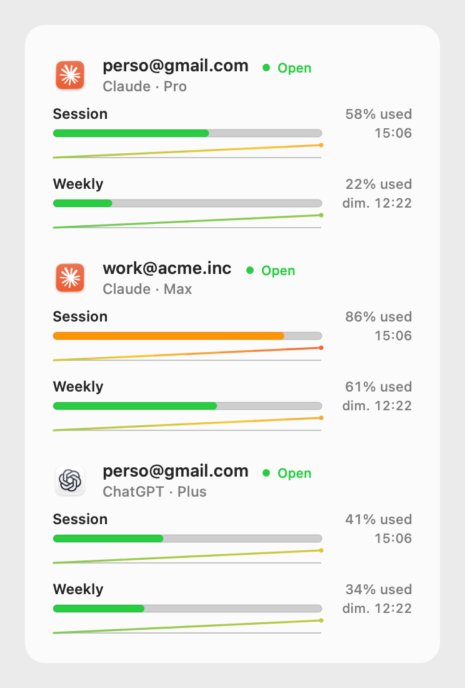
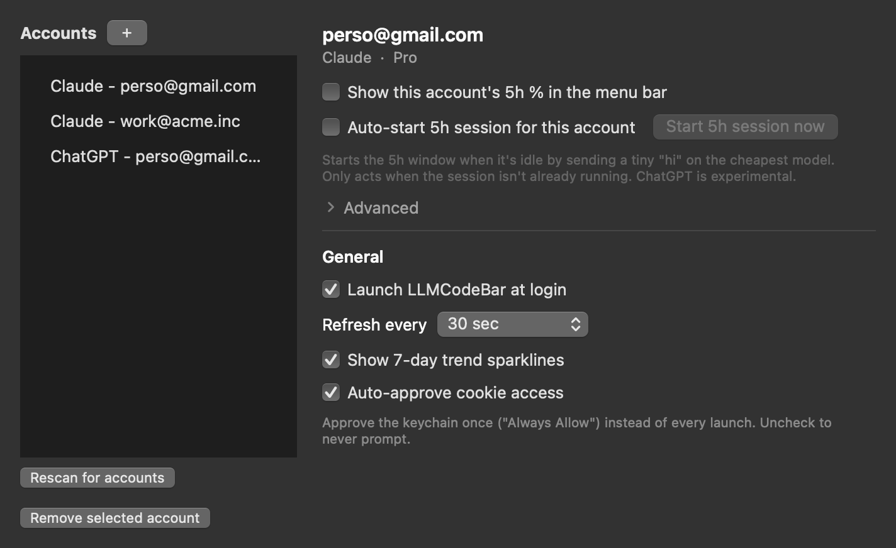

# LLMCodeBar

> Your Claude and ChatGPT limits in the menu bar. Built for running several accounts of the same provider, and auto starting your 5 hour session.



## Why this one

Plenty of menu bar apps show your Claude or ChatGPT usage. This one is built for two things they don't do.

**Run multiple accounts of the same provider.** Personal Claude and work Claude, right next to each other. Two ChatGPT logins. As many as you want, each in its own isolated window so they never clash. Click an account in the dropdown to open Claude or ChatGPT already signed into it.

**Auto start your 5 hour session.** The 5 hour window only starts counting from your first message, so an account you're not actively using never starts its clock. Turn this on and LLMCodeBar sends one tiny message on the cheapest model whenever the window is idle, so the session runs on a schedule instead of whenever you remember. Claude and ChatGPT, per account.

## Everything else

- Session (5h) and Weekly bars for every account, with reset times.
- A 7 day trend line per limit that goes green to red as you get close.
- Put up to two accounts' 5h % right in the menu bar, each with its app icon so you know which is which.

  
- Refresh from every 30 seconds to every 30 minutes.
- Launch at login.

## Install

Download **LLMCodeBar.dmg** from the [latest release](https://github.com/Franciskid/LLMCodeBar/releases/latest), open it, drag the app to Applications.

It's unsigned (no paid Apple Developer ID), so macOS blocks the first launch. Right click the app and pick Open, or run:

```sh
xattr -dr com.apple.quarantine "/Applications/LLMCodeBar.app"
```

macOS 13 or newer, universal (Apple Silicon and Intel). You also need the Claude and/or ChatGPT desktop apps installed and signed in.

## Settings



## How it gets the data

Local and read only, on your own accounts. Nothing leaves your machine except the usual requests to Anthropic and OpenAI.

- Reads your signed in Claude and ChatGPT profiles in `~/Library/Application Support` for the account and plan.
- Claude: your session cookies plus the claude.ai usage endpoint. ChatGPT: the OpenAI login token in `auth.json` plus the ChatGPT usage endpoint.
- Saves a small config and a 7 day usage history for the sparklines.

When Claude isn't running, it decrypts Claude's cookie key and macOS asks for your password once. Click **Always Allow** and it caches the key so it stops asking, or turn off **Auto approve cookie access** in Settings to keep it away from the keychain entirely.

These are the apps' internal endpoints, not official ones, so they can break if the providers change them.

## Build

```sh
git clone https://github.com/Franciskid/LLMCodeBar.git
cd LLMCodeBar
./scripts/install.sh   # build, install, launch
```

Plain Swift and AppKit, no Xcode project, no deps.

## License

MIT.
