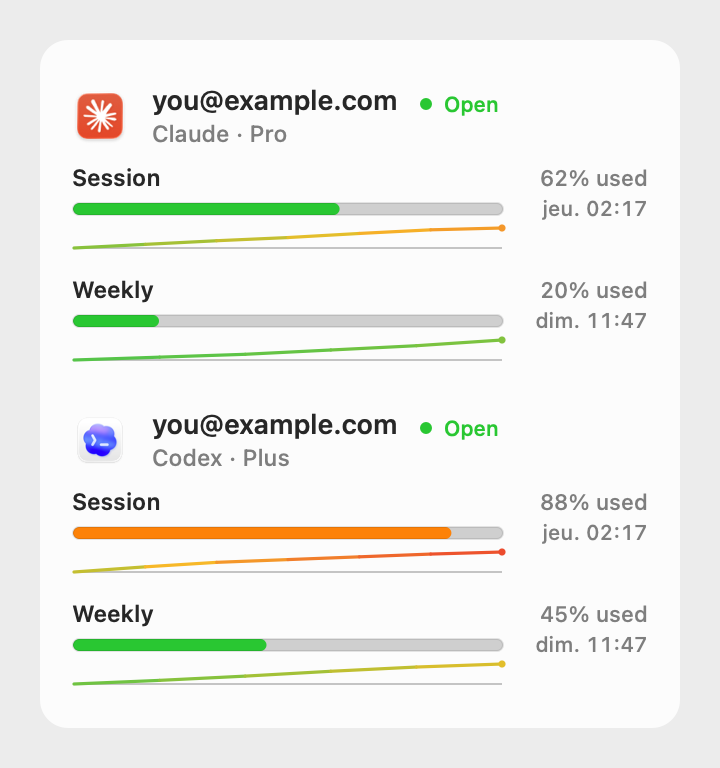
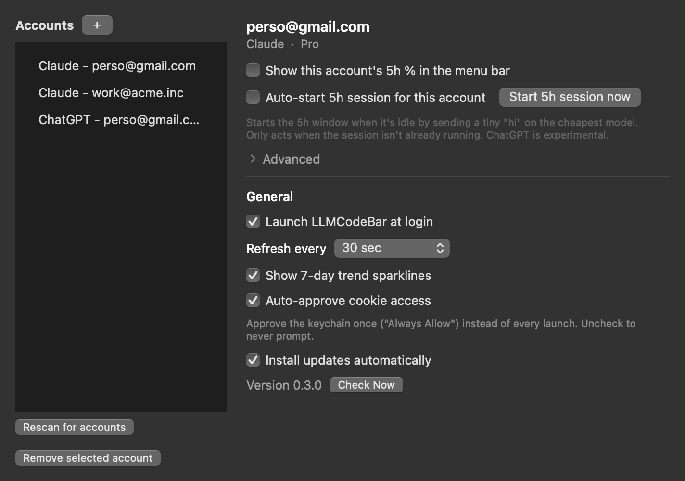

# LLMCodeBar

> Your Claude and ChatGPT limits in the menu bar. Built for running several accounts of the same provider, and auto starting your 5 hour session.



## Why this one

Plenty of menu bar apps show your Claude or ChatGPT usage. This one is built for two things they don't do.

**Run multiple accounts of the same provider.** Personal Claude and work Claude, right next to each other. Two ChatGPT logins. As many as you want, each in its own isolated window so they never clash. Click an account in the dropdown to open Claude or ChatGPT already signed into it.

**Auto start your 5 hour session.** The 5 hour window only starts counting from your first message, so an account you're not actively using never starts its clock. Turn this on and LLMCodeBar sends one tiny message on the cheapest model whenever the window is idle, so the session runs on a schedule instead of whenever you remember. Claude and ChatGPT, per account.

**Move a session to another account.** Run out mid conversation and you don't have to start over somewhere else. Open **Transfer session...**, search your Code sessions and chats, pick the account to send it to, and carry on there.

## Everything else

- Session (5h) and Weekly bars for every account, with reset times.
- A 7 day trend line per limit that goes green to red as you get close.
- Put up to two accounts' 5h % right in the menu bar, each with its app icon so you know which is which.

  
- Refresh from every 30 seconds to every 30 minutes.
- Keeps your Code history where you can find it. Claude files each Code session under the window it was created in, so when a re-login puts an account in your *other* Claude window, its whole history looks gone - it isn't, that window just has an empty folder for it. LLMCodeBar keeps every account's sessions present in every window, and offers to restart a window that has to reload them. It never overwrites a session the running app owns, and a session you delete stays deleted.
- Signs you in to the window you asked. With two Claude windows open, macOS hands a browser sign-in back to whichever one it likes, and the other one rejects it. LLMCodeBar holds the `claude://` link type, which makes Claude sign in inside its own window instead of sending you to the browser. Turn it off in Settings to hand the links back.
- Launch at login.
- Updates itself. It checks the releases page in the background, and installs a new version and restarts on its own. Turn that off in Settings and it offers the update in the menu instead.

## About transferring sessions

The two kinds work very differently, because Claude stores them in very different places.

**Claude Code sessions really move.** The desktop app keeps a small metadata file per session inside each account's folder, and it only points at the transcript, which lives in `~/.claude/projects` and belongs to no account in particular. LLMCodeBar copies that metadata into the other account, so:

- The whole session arrives, not a summary of it. It costs nothing and takes no time.
- Both accounts point at the *same* transcript, so continuing in the second account continues the same history, and the first account sees it too. It's as close to one session in two accounts as the machine allows.
- Because it is one file, don't run the same session in both accounts at once.
- The session appears at the top of the other account's Code list. Claude only reads that list when it launches, so if that account's window is already open it has to restart first - LLMCodeBar offers to do it for you.

**Chats are copied, not moved.** Claude has no way to hand a conversation to another account: a conversation belongs to one organization, there's no import, and sharing only produces a read-only snapshot. So LLMCodeBar exports the chat and opens a new one in the account you chose, attaching the whole conversation and asking Claude to continue from where it stopped. That means:

- The new chat holds one message - your transcript, attached - and Claude's one line "here's where we are" reply. Everything that was said is in the attachment, and Claude has read it.
- It costs one message of the destination account's usage.
- The two chats are independent afterwards. Nothing you say in one shows up in the other. Moving it back later is the same two clicks in reverse.
- Text comes across, files and images don't - they stay in the original account, and the transcript just names them.
- Very long conversations are trimmed to the most recent part, and the menu says so when that happens.
- The new chat's link is copied to your clipboard, and the destination Claude opens straight to it when it's the only Claude window running.

## Install

Download **LLMCodeBar.dmg** from the [latest release](https://github.com/Franciskid/LLMCodeBar/releases/latest), open it, drag the app to Applications.

It's unsigned (no paid Apple Developer ID), so macOS blocks the first launch. Right click the app and pick Open, or run:

```sh
xattr -dr com.apple.quarantine "/Applications/LLMCodeBar.app"
```

That first launch is the only time you have to do this. From then on LLMCodeBar keeps itself up to date: it checks for a new release in the background, swaps itself out and restarts, quarantine flag and all.

macOS 13 or newer, universal (Apple Silicon and Intel). You also need the Claude and/or ChatGPT desktop apps installed and signed in.

## Settings



## How it gets the data

Local and read only, on your own accounts. Nothing leaves your machine except the usual requests to Anthropic and OpenAI.

- Reads your signed in Claude and ChatGPT profiles in `~/Library/Application Support` for the account and plan.
- Claude: your session cookies plus the claude.ai usage endpoint. ChatGPT: the OpenAI login token in `auth.json` plus the ChatGPT usage endpoint.
- Saves a small config and a 7 day usage history for the sparklines.

When Claude isn't running, it decrypts Claude's cookie key and macOS asks for your password once. Click **Always Allow** and it caches the key so it stops asking, or turn off **Auto approve cookie access** in Settings to keep it away from the keychain entirely.

These are the apps' internal endpoints, not official ones, so they can break if the providers change them.

## Build

```sh
git clone https://github.com/Franciskid/LLMCodeBar.git
cd LLMCodeBar
./scripts/install.sh   # build, install, launch
```

Plain Swift and AppKit, no Xcode project, no deps.

## License

MIT.
